# Documentación Técnica — Lab de Detección Blue Team: Zeek + Suricata + Wazuh SIEM

## Índice

- [Documentación Técnica — Lab de Detección Blue Team: Zeek + Suricata + Wazuh SIEM](#documentación-técnica--lab-de-detección-blue-team-zeek--suricata--wazuh-siem)
  - [Índice](#índice)
  - [1. Reconocimiento de red — S01 (T1046)](#1-reconocimiento-de-red--s01-t1046)
    - [1.1 Escaneo Nmap desde Kali y alertas Suricata en tiempo real](#11-escaneo-nmap-desde-kali-y-alertas-suricata-en-tiempo-real)
    - [1.2 Zeek — conn.log del tráfico de reconocimiento](#12-zeek--connlog-del-tráfico-de-reconocimiento)
  - [2. Reglas Suricata custom desplegadas](#2-reglas-suricata-custom-desplegadas)
    - [2.1 Despliegue de custom.rules](#21-despliegue-de-customrules)
    - [2.2 Recarga y verificación del servicio Suricata](#22-recarga-y-verificación-del-servicio-suricata)
  - [3. Brute Force contra Active Directory — S02 (T1110.001)](#3-brute-force-contra-active-directory--s02-t1110001)
    - [3.1 Ataque de diccionario con NetExec](#31-ataque-de-diccionario-con-netexec)
    - [3.2 Detección en Wazuh — Event ID 4625](#32-detección-en-wazuh--event-id-4625)
  - [4. Reglas Wazuh custom desplegadas](#4-reglas-wazuh-custom-desplegadas)
    - [4.1 Edición de local\_rules\_lab.xml](#41-edición-de-local_rules_labxml)
    - [4.2 Ruleset activo en Wazuh](#42-ruleset-activo-en-wazuh)
    - [4.3 Verificación del agente Wazuh en el Domain Controller](#43-verificación-del-agente-wazuh-en-el-domain-controller)
  - [5. Kerberoasting — S03 (T1558.003)](#5-kerberoasting--s03-t1558003)
    - [5.1 Solicitud de TGS con impacket GetUserSPNs.py](#51-solicitud-de-tgs-con-impacket-getuserspnspy)
    - [5.2 Detección en Zeek — kerberos.log](#52-detección-en-zeek--kerberoslog)

---

## 1. Reconocimiento de red — S01 (T1046)

### 1.1 Escaneo Nmap desde Kali y alertas Suricata en tiempo real

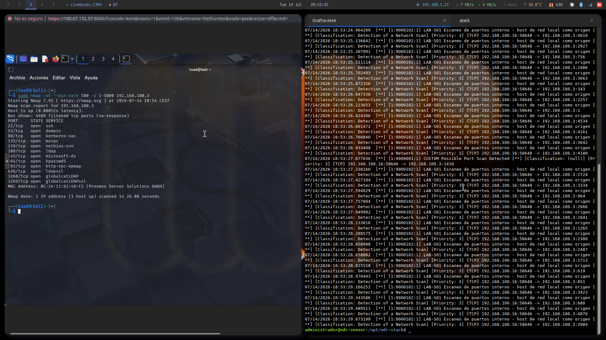

Captura dividida en dos consolas. A la izquierda, sesión **noVNC** contra la VM atacante (`Nethunter`, VMID 100) en el nodo `pve`, con Kali ejecutando:

```bash
sudo nmap -sS --min-rate 500 -p 1-5000 192.168.100.3
```

El resultado confirma el host **192.168.100.3** activo y expone el perfil típico de un **Domain Controller** de Active Directory: puertos **22** (ssh), **53** (domain), **88** (kerberos-sec), **135** (msrpc), **139** (netbios-ssn), **389** (ldap), **445** (microsoft-ds), **464** (kpasswd5), **593** (http-rpc-epmap), **636** (ldapssl), **3268** (globalcatLDAP) y **3269** (globalcatLDAPssl) abiertos, con MAC **BC:24:11:62:48:F2** (Proxmox Server Solutions GmbH) y escaneo completado en **26.08 segundos**.

A la derecha, terminal SSH contra `administrador@ndr-sensor` con la pestaña **atack** activa, mostrando en vivo las alertas generadas por Suricata durante el escaneo:

```
[1:9000102:1] LAB-S01 Escaneo de puertos interno - host de red local como origen [**]
[Classification: Detection of a Network Scan] [Priority: 3] {TCP} 192.168.100.16:58648 -> 192.168.100.3:<puerto>
```

La alerta corresponde al **SID 9000102** (regla custom para escaneo interno) y se dispara de forma repetida entre las **18:53:24** y las **18:53:29** del **14/07/2026**, una entrada por cada puerto sondeado desde el origen **192.168.100.16** (Kali). También aparece una alerta puntual **[1:9000001:1] CUSTOM Possible Port Scan Detected**, de una firma genérica adicional del feed. La correlación temporal entre el `nmap` de la izquierda y el aluvión de alertas de la derecha demuestra la detección en tiempo real del reconocimiento activo.

---

### 1.2 Zeek — conn.log del tráfico de reconocimiento

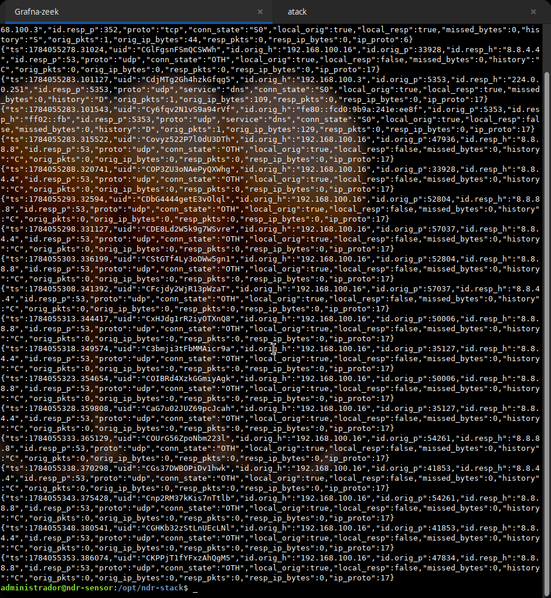

Pestaña **Grafna-zeek** del mismo terminal, mostrando el contenido en crudo de `conn.log` (formato JSON) capturado por Zeek para el mismo periodo del escaneo. La primera línea, cortada por el borde superior de la ventana, es el verdadero fingerprint del SYN scan: `"...68.100.3","id.resp_p":352,"proto":"tcp","conn_state":"S0",...,"history":"S","orig_pkts":1,...}` — una conexión **TCP** contra el puerto **352** del DC (**192.168.100.3**) con `conn_state:"S0"` e `history:"S"` (solo se observó el SYN del origen, sin respuesta), el estado exacto que deja un `nmap -sS` al sondear un puerto cerrado o filtrado.

El resto de las entradas visibles en la captura no pertenecen al escaneo TCP: son tráfico **UDP** concurrente generado por el propio Kali mientras corría el `nmap` — consultas DNS reales desde **192.168.100.16** hacia los resolutores externos **8.8.8.8** y **8.8.4.4** por el puerto **53** (`conn_state:"OTH"`, `history:"C"`), además de un par de consultas **mDNS** hacia el multicast **224.0.0.251:5353** (IPv4) y **ff02::fb:5353** (IPv6, desde la dirección link-local `fe80::fcd0:9b9a:241e:ee8f`), ambas con `conn_state:"S0"` e `history:"D"`. Es decir, el pantallazo mezcla en la misma ventana de tiempo la única entrada S0/TCP del escaneo (arriba, truncada) con el ruido de fondo de resolución de nombres de la máquina atacante — Zeek registra ambos flujos por igual en `conn.log`, y solo el primero es atribuible al reconocimiento activo contra el DC. Cada registro incluye un `uid` único de Zeek (p. ej. `CdjMTg2Gh4hzkGfqg5`, `Covyz522P7l0dU3DTh`) que permite correlacionar la conexión con el resto de logs del stack (`dns.log`, `notice.log`) durante una investigación.

---

## 2. Reglas Suricata custom desplegadas

### 2.1 Despliegue de custom.rules

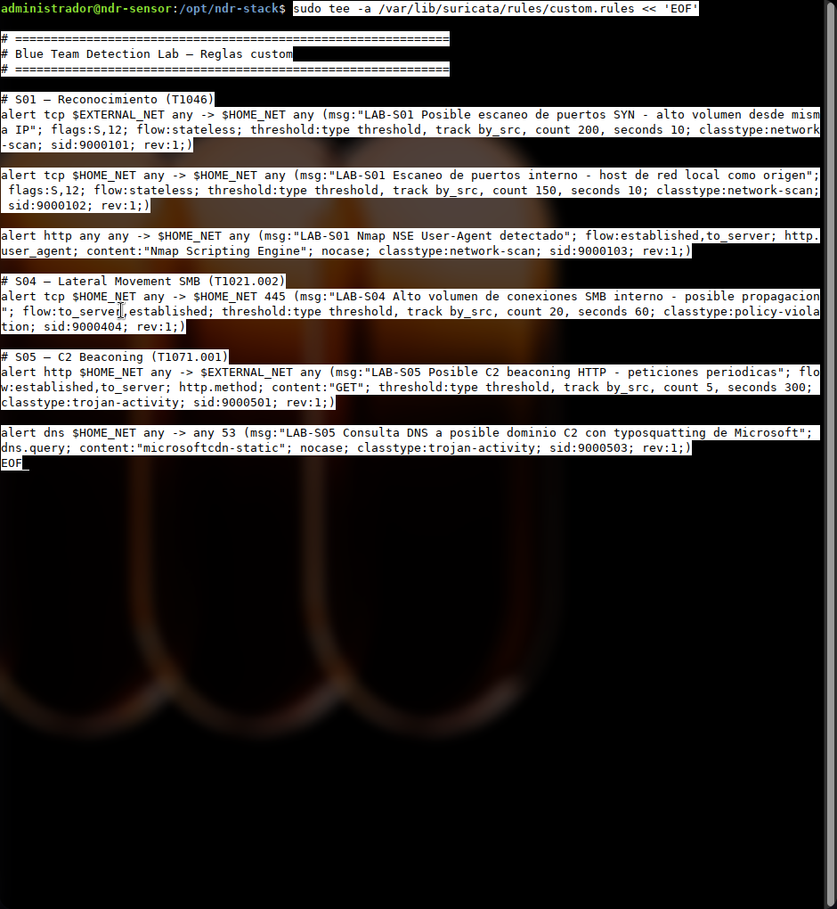

Terminal `administrador@ndr-sensor` escribiendo el fichero de reglas mediante heredoc:

```bash
sudo tee -a /var/lib/suricata/rules/custom.rules << 'EOF'
```

El contenido volcado define las firmas custom del laboratorio, agrupadas por escenario:

| SID | Escenario | Regla |
|---|---|---|
| 9000101 | S01 | `alert tcp $EXTERNAL_NET any -> $HOME_NET any` — escaneo SYN de alto volumen desde una misma IP externa (`flags:S,12`, `threshold count 200/10s`) |
| 9000102 | S01 | `alert tcp $HOME_NET any -> $HOME_NET any` — escaneo de puertos interno, host de red local como origen (`threshold count 150/10s`) |
| 9000103 | S01 | `alert http any any -> $HOME_NET any` — detección del User-Agent **Nmap Scripting Engine** en peticiones HTTP |
| 9000404 | S04 | `alert tcp $HOME_NET any -> $HOME_NET 445` — alto volumen de conexiones SMB internas, posible propagación (`threshold count 20/60s`) |
| 9000501 | S05 | `alert http $HOME_NET any -> $EXTERNAL_NET any` — posible C2 beaconing HTTP por peticiones GET periódicas (`threshold count 5/300s`) |
| 9000503 | S05 | `alert dns $HOME_NET any -> any 53` — consulta DNS a dominio con typosquatting (`content:"microsoftcdn-static"`) |

Todas las reglas usan `classtype` acorde a su naturaleza (`network-scan`, `policy-violation`, `trojan-activity`) y `rev:1`, quedando listas para ser cargadas por el motor.

---

### 2.2 Recarga y verificación del servicio Suricata

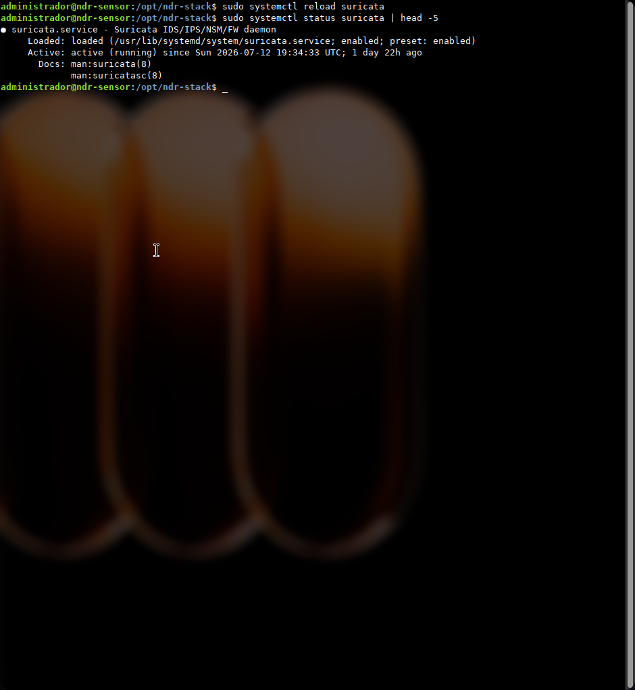

Tras añadir las reglas, se recarga la configuración en caliente y se verifica el estado del daemon:

```bash
administrador@ndr-sensor:/opt/ndr-stack$ sudo systemctl reload suricata
administrador@ndr-sensor:/opt/ndr-stack$ sudo systemctl status suricata | head -5
● suricata.service - Suricata IDS/IPS/NSM/FW daemon
   Loaded: loaded (/usr/lib/systemd/system/suricata.service; enabled; preset: enabled)
   Active: active (running) since Sun 2026-07-12 19:34:33 UTC; 1 day 22h ago
```

El uso de `reload` en lugar de `restart` aplica el nuevo `custom.rules` sin cortar la captura de paquetes en curso, evitando una ventana ciega en la detección. El servicio lleva **1 día y 22 horas** activo de forma continua.

---

## 3. Brute Force contra Active Directory — S02 (T1110.001)

### 3.1 Ataque de diccionario con NetExec

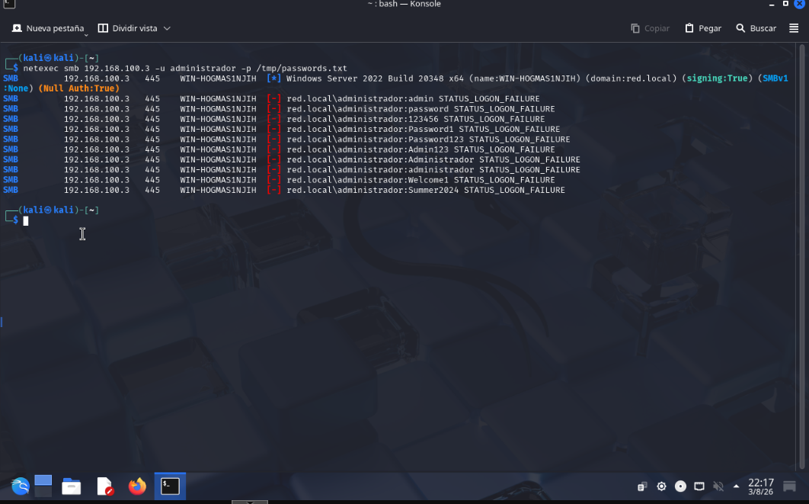

Terminal Kali ejecutando un ataque de fuerza bruta por SMB contra el Domain Controller:

```bash
netexec smb 192.168.100.3 -u administrador -p /tmp/passwords.txt
```

La primera línea confirma el reconocimiento del objetivo: **Windows Server 2022 Build 20348 x64** (`name:WIN-HOGMAS1NJIH`, `domain:red.local`, `signing:True`, `SMBv1:None`, `Null Auth:True`). A continuación, NetExec prueba secuencialmente el diccionario contra la cuenta `red.local\administrador` — `admin`, `password`, `123456`, `Password1`, `Password123`, `Admin123`, `Administrador`, `administrador`, `Welcome1`, `Summer2024` — devolviendo **STATUS_LOGON_FAILURE** en cada intento. Cada intento fallido contra el DC genera un **Event ID 4625** de Windows Security, que es precisamente lo que capturan las reglas Wazuh del apartado 4.

---

### 3.2 Detección en Wazuh — Event ID 4625

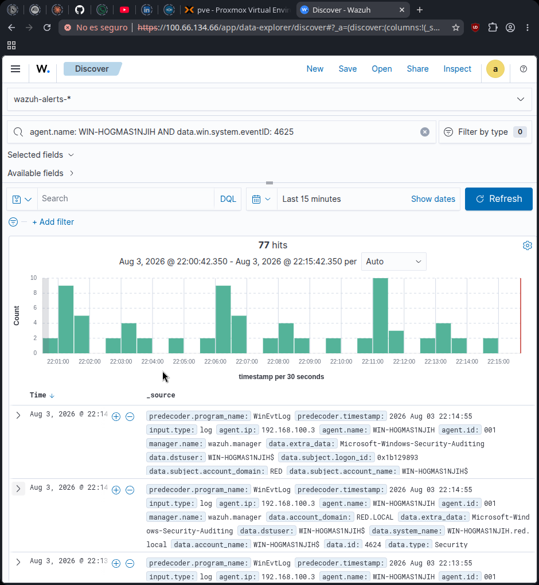

Vista **Discover** de Wazuh sobre el índice `wazuh-alerts-*`, con el filtro `agent.name: WIN-HOGMAS1NJIH AND data.win.system.eventID: 4625` y rango **Last 15 minutes**. El histograma muestra **77 hits** entre las **22:00:42** y las **22:15:42** del 3 de agosto de 2026, agregados en barras de 30 segundos, con tres picos claramente diferenciados (~22:01, ~22:06 y ~22:11) que reflejan las tandas sucesivas del diccionario lanzado por NetExec.

Los registros individuales confirman el origen de los eventos: `agent.ip` **192.168.100.3**, `agent.name` **WIN-HOGMAS1NJIH**, `manager.name` **wazuh.manager**, con `data.subject.account_domain` **RED**/**RED.LOCAL** y `predecoder.program_name` **WinEvtLog**, es decir, eventos de seguridad de Windows recolectados por el agente Wazuh instalado en el propio Domain Controller y reenviados al manager para su correlación.

---

## 4. Reglas Wazuh custom desplegadas

### 4.1 Edición de local_rules_lab.xml

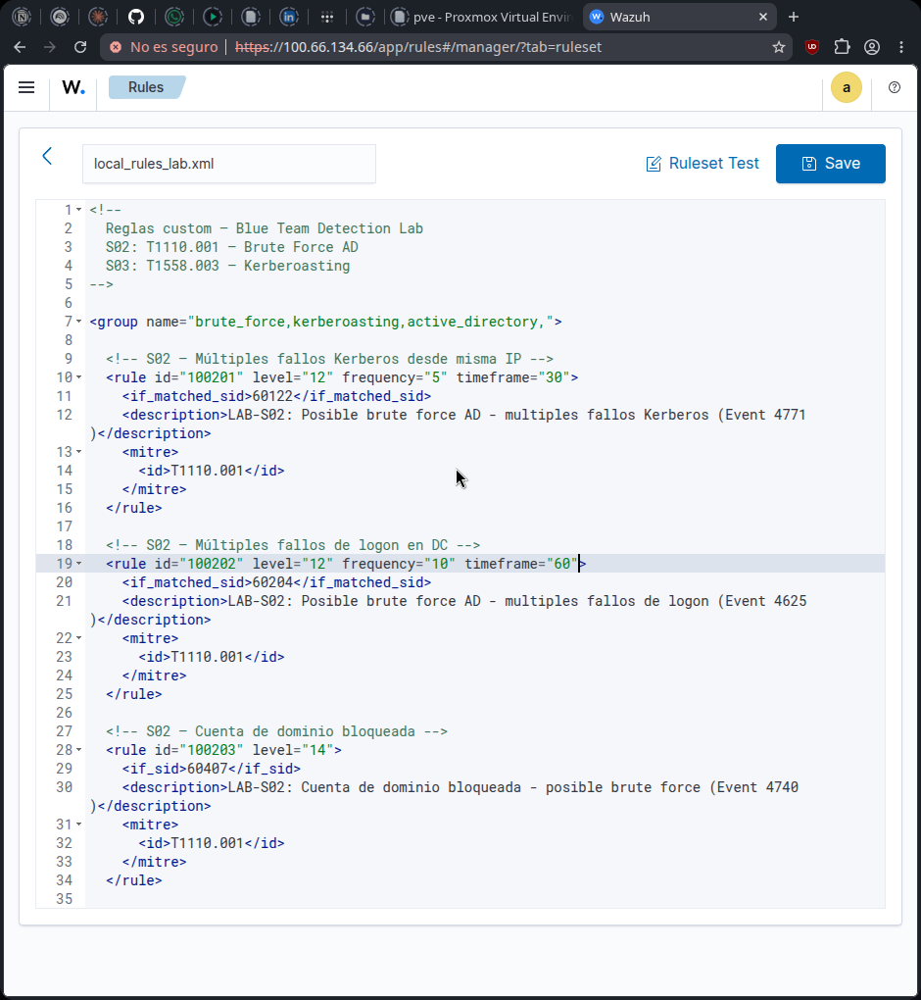

Editor integrado de Wazuh (**Rules → local_rules_lab.xml**). La cabecera del fichero identifica su alcance — **S02: T1110.001 — Brute Force AD** y **S03: T1558.003 — Kerberoasting** — dentro del grupo `brute_force,kerberoasting,active_directory,`. Se aprecian las tres primeras reglas del bloque S02:

```xml
<rule id="100201" level="12" frequency="5" timeframe="30">
  <if_matched_sid>60122</if_matched_sid>
  <description>LAB-S02: Posible brute force AD - multiples fallos Kerberos (Event 4771)</description>
  <mitre><id>T1110.001</id></mitre>
</rule>

<rule id="100202" level="12" frequency="10" timeframe="60">
  <if_matched_sid>60204</if_matched_sid>
  <description>LAB-S02: Posible brute force AD - multiples fallos de logon (Event 4625)</description>
  <mitre><id>T1110.001</id></mitre>
</rule>

<rule id="100203" level="14">
  <if_sid>60407</if_sid>
  <description>LAB-S02: Cuenta de dominio bloqueada - posible brute force (Event 4740)</description>
  <mitre><id>T1110.001</id></mitre>
</rule>
```

La regla **100201** correla varios fallos Kerberos (Event **4771**) en una ventana de **30 s**, la **100202** correla fallos de logon (Event **4625**, el mismo tipo de evento visto en el apartado 3.2) en **60 s**, y la **100203**, de nivel **14** (el más alto del grupo), dispara ante un bloqueo de cuenta de dominio (Event **4740**) sin necesidad de umbral de frecuencia, al ser un indicador de compromiso por sí solo.

---

### 4.2 Ruleset activo en Wazuh

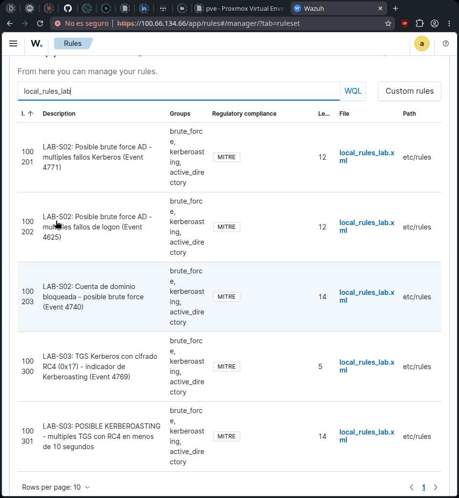

Listado de **Rules → Custom rules** filtrado por `local_rules_lab`, con las cinco reglas ya cargadas en el manager:

| ID | Nivel | Descripción |
|---|---|---|
| 100201 | 12 | Posible brute force AD — múltiples fallos Kerberos (Event 4771) |
| 100202 | 12 | Posible brute force AD — múltiples fallos de logon (Event 4625) |
| 100203 | 14 | Cuenta de dominio bloqueada — posible brute force (Event 4740) |
| 100300 | 5 | TGS Kerberos con cifrado RC4 (0x17) — indicador de Kerberoasting (Event 4769) |
| 100301 | 14 | POSIBLE KERBEROASTING — múltiples TGS con RC4 en menos de 10 segundos |

Todas quedan etiquetadas con los grupos **brute_force**, **kerberoasting**, **active_directory** y el badge de cumplimiento **MITRE**, y residen en el mismo fichero `local_rules_lab.xml` bajo `etc/rules`. La regla **100301** es la de mayor severidad del bloque de Kerberoasting: escala a nivel **14** cuando la 100300 (nivel 5, un simple indicio) se repite más de una vez en menos de 10 segundos, el patrón característico de una herramienta automatizada como `GetUserSPNs.py` solicitando varios tickets seguidos.

---

### 4.3 Verificación del agente Wazuh en el Domain Controller

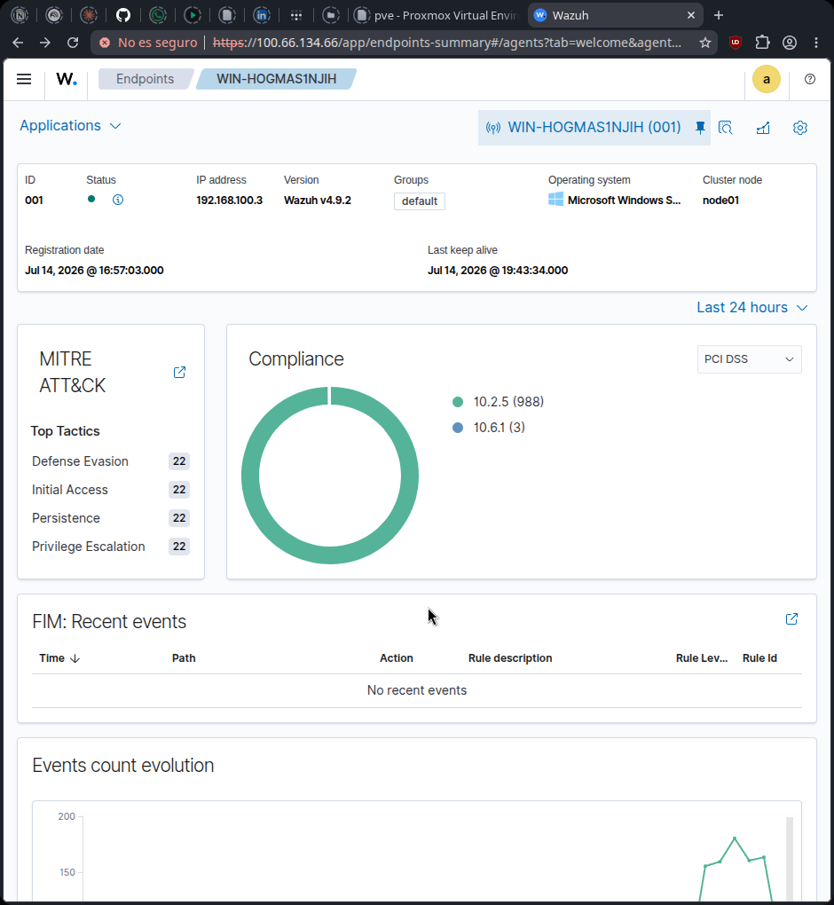

Ficha de **Endpoints → WIN-HOGMAS1NJIH** en Wazuh. El agente **001** figura **activo** (punto verde), con IP **192.168.100.3**, versión de agente **Wazuh v4.9.2**, grupo **default**, sistema operativo **Microsoft Windows Server**, nodo de clúster **node01**, registrado el **14 jul 2026 16:57:03** y con último *keep alive* el **14 jul 2026 19:43:34** — confirmando que la telemetría usada en los apartados 3.2 y posteriormente en 5.2 proviene de un agente correctamente desplegado y comunicándose con el manager.

El panel **MITRE ATT&CK** resume las tácticas más vistas en los eventos del propio Windows sobre este endpoint (**Defense Evasion**, **Initial Access**, **Persistence** y **Privilege Escalation**, con 22 ocurrencias cada una), y el donut de **Compliance PCI DSS** muestra el desglose por control (**10.2.5**: 988 eventos, **10.6.1**: 3 eventos). El bloque **FIM: Recent events** no registra cambios de integridad de ficheros en las últimas 24 horas.

---

## 5. Kerberoasting — S03 (T1558.003)

### 5.1 Solicitud de TGS con impacket GetUserSPNs.py

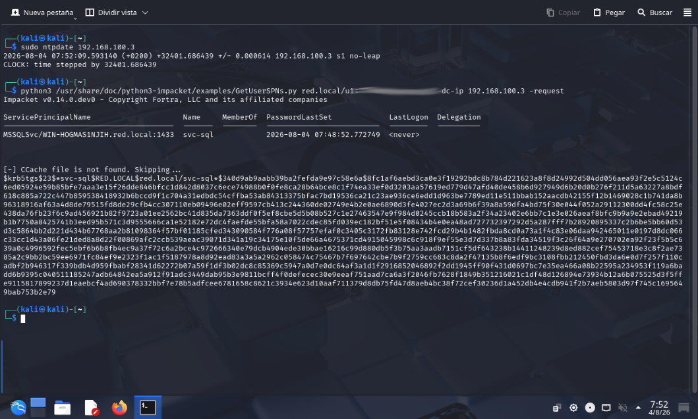

Terminal Kali. Primero se sincroniza el reloj con el Domain Controller — paso obligatorio en Kerberos, que rechaza tickets con un *skew* horario excesivo:

```bash
sudo ntpdate 192.168.100.3
# CLOCK: time stepped by 32401.686439
```

A continuación se lanza la herramienta de Impacket que automatiza el ataque:

```bash
python3 /usr/share/doc/python3-impacket/examples/GetUserSPNs.py red.local/u1:<password>@192.168.100.3 -dc-ip 192.168.100.3 -request
```

Impacket **v0.14.0.dev0** enumera los SPN del dominio y devuelve la cuenta de servicio **svc-sql**, asociada al SPN **MSSQLSvc/WIN-HOGMAS1NJIH.red.local:1433**, con `PasswordLastSet` **2026-08-04 07:48:52** y `LastLogon` **\<never\>**. Con el flag `-request`, la herramienta solicita el TGS para ese SPN y vuelca directamente el hash crackeable offline:

```
$krb5tgs$23$*svc-sql$RED.LOCAL$red.local/svc-sql*$...
```

El prefijo **`$krb5tgs$23$`** indica que el ticket va cifrado con **etype 23 (RC4-HMAC)** — el algoritmo heredado y débil que hace viable el cracking por fuerza bruta offline sin volver a tocar el DC, la esencia del Kerberoasting.

---

### 5.2 Detección en Zeek — kerberos.log

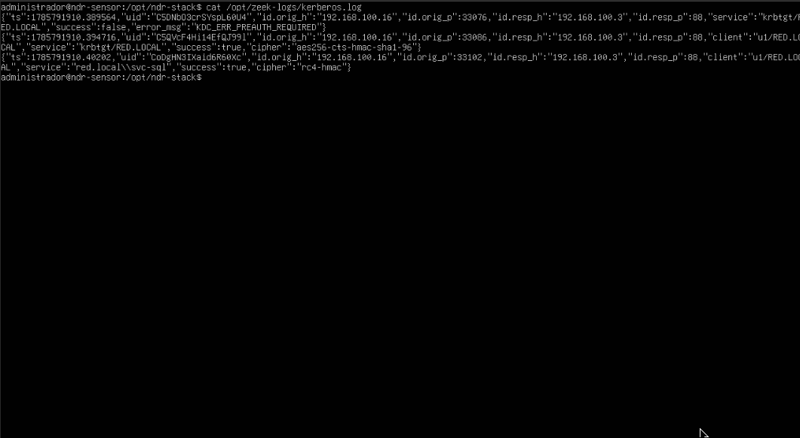

Terminal `administrador@ndr-sensor`, comando `cat /opt/zeek-logs/kerberos.log`, mostrando tres eventos consecutivos capturados por Zeek durante el ataque anterior:

1. **AS-REQ fallida** — `id.orig_h` **192.168.100.16** (Kali) contra `id.resp_h` **192.168.100.3:88**, `service:"krbtgt/RED.LOCAL"`, `success:false`, `error_msg:"KDC_ERR_PREAUTH_REQUIRED"` — el intercambio inicial de autenticación previa a obtener el TGT.
2. **TGT concedido** — mismo origen, `client:"u1/RED.LOCAL"`, `service:"krbtgt/RED.LOCAL"`, `success:true`, `cipher:"aes256-cts-hmac-sha1-96"` — el usuario `u1` obtiene su ticket de sesión con un cifrado moderno y seguro (AES256).
3. **TGS para svc-sql** — mismo cliente `u1/RED.LOCAL`, `service:"red.local\\svc-sql"`, `success:true`, **`cipher:"rc4-hmac"`** — la solicitud del ticket de servicio para **svc-sql** se resuelve con **RC4-HMAC** en lugar de AES, pese a que la autenticación inicial del usuario sí usó AES256.

Esa discrepancia de cifrado entre el TGT (AES256) y el TGS (RC4-HMAC) para una cuenta de servicio es la firma de red del Kerberoasting: el atacante no elige el cifrado del ticket, lo determina el `msDS-SupportedEncryptionTypes` configurado en la cuenta `svc-sql`, y es exactamente el campo que consulta la regla Wazuh **100300** (`ticketEncryptionType` `0x17`) del apartado 4.1 para generar la alerta.

---

*Documentación generada el 3 de agosto de 2026 basada en capturas del despliegue del Blue Team Detection Lab sobre Proxmox VE, con detección de ataques contra Active Directory mediante Zeek, Suricata y Wazuh SIEM.*
